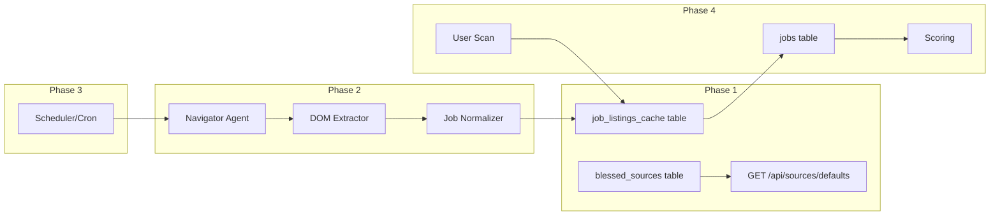

# Blessed Sources and Job Listings Cache — Implementation Plan

This plan follows [miscellaneous/project_plan_next.md](miscellaneous/project_plan_next.md) and aligns with [miscellaneous/project_scope.md](miscellaneous/project_scope.md). Current codebase state:

- **Blessed sources:** In code only at [packages/db/src/seed.ts](packages/db/src/seed.ts) (`BLESSED_SOURCES`). [apps/web/app/api/sources/defaults/route.ts](apps/web/app/api/sources/defaults/route.ts) returns `{ name, url, type }`; no DB.
- **User sources:** [packages/db/src/schema.ts](packages/db/src/schema.ts) `sources` table has no `blessed_source_id`. [packages/db/src/sources.ts](packages/db/src/sources.ts) `addSource` takes name, url, type, isBlessed only.
- **Jobs:** [packages/db/src/schema.ts](packages/db/src/schema.ts) `jobs` is run/user/source-scoped; no shared cache table.
- **Agents:** [agents/src/browser/](agents/src/browser/) has Navigator (placeholder — not wired to Playwright), DOM Extractor (implemented: JSON-LD, heuristics, LLM fallback), Pagination, Source Validator. [agents/src/normalize/job-normalizer-agent.ts](agents/src/normalize/job-normalizer-agent.ts) produces `NormalizedJob` with `runId`/`sourceId`; will need a cache-oriented path (no run, use `blessed_source_id`).
- **Playwright:** Only `@playwright/test` in lockfile; add `playwright` for programmatic use in scraper/scripts.

---

## Phase 1: Database and Seeding

**1.1 Add `blessed_sources` table**

- In [packages/db/src/schema.ts](packages/db/src/schema.ts): new enum `scrapeStatusEnum('last_scrape_status', ['SUCCESS', 'FAILED', 'PARTIAL'])`. New table `blessed_sources` with: `id` (uuid PK), `name`, `url`, `type` (existing `sourceTypeEnum`), `slug` (varchar 64 optional), `enabled_for_scraping` (boolean), `scrape_interval_minutes` (integer optional), `last_scraped_at`, `last_scrape_status` (enum optional), `created_at`, `updated_at`. No `user_id`.
- Generate migration: `pnpm --filter @careersignal/db exec drizzle-kit generate` (or project equivalent).

**1.2 Seed `blessed_sources`**

- In [packages/db/src/seed.ts](packages/db/src/seed.ts): add `seedBlessedSourcesTable()` that reads from `BLESSED_SOURCES`, maps to DB rows (with slug e.g. `wellfound`, `linkedin_jobs` from name), sets `enabled_for_scraping: true`, `scrape_interval_minutes: 1440`. Insert only if table is empty (idempotent). Call from app startup or a small seed script so DB is populated after migration.

**1.3 Add `job_listings_cache` table**

- In same schema: table `job_listings_cache` with `**id` (uuid PK) — one stable ID per listing so we can tie it to users later (see “Stable job listing ID and user tie-in” below). Plus FK `blessed_source_id` → `blessed_sources.id`, and columns per plan § 3.3: `title`, `company_name`, `source_url`, `location`, `remote_type`, `seniority`, `employment_type`, `visa_sponsorship`, `description`, `requirements` (jsonb), `posted_date`, `salary\`, `department`, `team`, `apply_url`, `raw_extract`, `evidence_refs`, `confidence`, `dedupe_key`, `first_seen_at`, `last_seen_at`, `created_at`, `updated_at`. Reuse existing enums where applicable (`seniorityEnum`, `employmentTypeEnum`). Add unique/index on `(blessed_source_id, dedupe_key)`for upserts; index on`(blessed_source_id, last_seen_at)` for “current” listings.

**1.4 Optional: link user sources to blessed**

- Migration: add nullable `blessed_source_id` (uuid FK → `blessed_sources`) to `sources`.
- [packages/db/src/sources.ts](packages/db/src/sources.ts): extend `addSource` to accept optional `blessedSourceId` and persist it.
- [packages/schemas/src/source.ts](packages/schemas/src/source.ts): add optional `blessed_source_id` to input schema.
- [apps/web/app/api/sources/route.ts](apps/web/app/api/sources/route.ts): pass `blessed_source_id` from body to `addSource` when present.

**1.5 Default sources API from DB**

- [apps/web/app/api/sources/defaults/route.ts](apps/web/app/api/sources/defaults/route.ts): query `blessed_sources` (e.g. `getDb().select().from(blessed_sources)`). If empty, fall back to `BLESSED_SOURCES` and optionally call `seedBlessedSourcesTable()` then re-query. Return array of `{ id, name, url, type, slug? }` so the UI can send `blessed_source_id` when adding a default.

**1.6 Optional: “Seed my sources” from blessed**

- Either a new API (e.g. `POST /api/sources/seed-defaults`) or one-time behavior: for each `blessed_sources` row, insert into `sources` for the current user with `blessed_source_id` set, idempotent by `blessed_source_id` (skip if user already has a source with that `blessed_source_id`). UI: optional “Add all default sources” button that calls this.

**Phase 1 exit:** Blessed sources in DB; GET defaults returns from DB (with `id`); adding a default source from UI can store `blessed_source_id`; no scraping yet.

---

## Stable job listing ID and user tie-in

- **Stable ID:** Every row in `job_listings_cache` has a persistent `**id` (uuid). Same logical job across scrapes is the same row (upsert by `dedupe_key`), so the same `id` over time. That ID is the canonical handle for “this listing” across the app.
- **Copy cache → jobs with reference:** When copying from cache into `jobs` (Phase 4), store the cache row’s `id` on each `jobs` row. Add optional `**job_listing_cache_id` (uuid FK → `job_listings_cache.id`) to the existing `jobs` table so we know which cached listing a job came from.
- **Future: user–job association:** Later you can key off `(user_id, job_listing_cache_id)` to:
  - Skip re-ranking or re-showing jobs the user has already applied to, dismissed, or added to the tracker.
  - Use a small table (e.g. `user_job_state` or flags on an existing table) with state like “applied” / “dismissed” / “in_tracker”; exact semantics and UX (e.g. “don’t rank again” vs “show but mark as seen”) can be decided when you implement it.
- No change to Phase 2/3 pipeline: upsert still uses `(blessed_source_id, dedupe_key)`; the row `id` is already there. Phase 4 copy step and `jobs.job_listing_cache_id` are the only additions for this design.

---

## Phase 2: Scraping pipeline for one blessed source

**2.1 Playwright + Browser Navigator**

- Add dependency `playwright` where the scraper runs (e.g. root or `apps/web` or a dedicated `scripts`/scraper package). Implement [agents/src/browser/navigator-agent.ts](agents/src/browser/navigator-agent.ts) `navigateToUrl` to use Playwright: launch browser (headless), new page, goto URL, wait for load, capture HTML (and optionally screenshot). Return `PageArtifact` (html, optional paths). Artifacts under `artifacts/blessed/{blessed_source_id}/{timestamp}/` per scope. API: accept `url` and optional `blessedSourceId` for paths.

**2.2 DOM Extractor for one source**

- Pick one source (e.g. Wellfound) and add a site-specific extraction path: either a recipe in [agents/src/browser/dom-extractor-agent.ts](agents/src/browser/dom-extractor-agent.ts) keyed by host/slug, or a separate wellfound extractor that returns `RawJobListing[]`. Use existing `extractJobsFromHtml` as fallback. Output: list of raw job objects (title, company, link, snippet, etc.).

**2.3 Pagination (if needed)**

- For the chosen source, implement “next page” or “load more” in [agents/src/browser/pagination-agent.ts](agents/src/browser/pagination-agent.ts) or in the same script: either URL param (e.g. `?page=2`) or Playwright click on “Next”. Loop until no more pages; collect HTML per page and run extractor on each.

**2.4 Job Normalizer for cache**

- Add a cache-oriented normalization path that does **not** require `runId`/`sourceId`: e.g. `normalizeJobForCache(raw, blessedSourceId)` in [agents/src/normalize/job-normalizer-agent.ts](agents/src/normalize/job-normalizer-agent.ts) (or a thin wrapper) that produces the same canonical shape but with `blessed_source_id` instead of run/source, and returns a type compatible with `job_listings_cache` row (first_seen_at/last_seen_at set by DB upsert logic).

**2.5 Upsert into `job_listings_cache`**

- New module or script: for each normalized listing, upsert into `job_listings_cache` on `(blessed_source_id, dedupe_key)`: insert with new uuid `id`, `first_seen_at`/`last_seen_at` = now, or update `last_seen_at` and any changed fields. Same row keeps the same `id` across scrapes so user tie-in stays stable. Do not delete listings that disappear from the page (use `last_seen_at` for “current” filter later).

**2.6 Update `blessed_sources` after run**

- After scrape completes (or fails), update `blessed_sources`: set `last_scraped_at`, `last_scrape_status` (SUCCESS or FAILED).

**2.7 Manual run**

- Single script or CLI: e.g. `node scripts/scrape-blessed-source.mjs wellfound` (or by id). Runs Navigator → (Pagination) → DOM Extractor → Normalizer → upsert cache → update blessed_sources. Verify rows in `job_listings_cache` and artifact files.

**Phase 2 exit:** One blessed source is scraped end-to-end; cache populated; artifacts stored; no schedule yet.

---

## Phase 3: Background / continuous scraping

**3.1 Scheduler**

- Simple approach: DB-backed job table or a small “scrape queue” (e.g. next_due per `blessed_source_id`), or OS cron that runs a script every N minutes. Script: select blessed sources where `enabled_for_scraping` and `last_scraped_at + scrape_interval_minutes` < now (or round-robin), run Phase 2 pipeline for one source per invocation. No Temporal for V1.

**3.2 Rate limiting and failure handling**

- Per-domain or per–blessed_source delay between requests; configurable. On failure: set `last_scrape_status = FAILED`, log, optional retry with backoff; do not block other sources.

**3.3 Expand to more sources**

- Replicate Phase 2 for a second (and more) blessed source: site-specific extractor + pagination. Prioritize easier/high-value boards.

**Phase 3 exit:** At least one source scraped on a schedule; cache updated periodically without user action.

---

## Phase 4: Wire user sources and scans to cache

**4.1 Scan reads from cache**

- Where scan runs currently (e.g. run creation, job ingestion): for each enabled user source that has `blessed_source_id` set, load from `job_listings_cache` where `blessed_source_id = source.blessed_source_id` and `last_seen_at` within last N days. Copy rows into `jobs` with current `run_id`, `user_id`, `source_id` (user’s source) and `**job_listing_cache_id` = cache row’s `id` so we can later skip re-ranking or re-showing jobs the user has already tied (applied, dismissed, in tracker). For user sources without `blessed_source_id`, keep existing behavior (future: live scrape or “no cache” path).

**4.2 Scoring**

- Existing Rule Scorer + LLM Ranker continue to run on the copied `jobs`; fill `match_score`, `strict_filter_pass`, etc. No changes to scoring logic.

**4.3 Sources page job count**

- Default source cards currently show “0 jobs”. When listing defaults, for each blessed source fetch count from `job_listings_cache` where `blessed_source_id = id` and `last_seen_at` within last 7 (or 30) days. Return count in defaults API or via a separate count endpoint; [apps/web/app/sources/page.tsx](apps/web/app/sources/page.tsx) displays it (e.g. “142 jobs” instead of “0 jobs”).

**Phase 4 exit:** User scan for a blessed source uses cache; Sources page shows cached job counts.

---

## Data flow (high level)

---

## Files to add or touch (summary)

| Phase | Files                                                                                                                                                                                                                                                                                                          |
| ----- | -------------------------------------------------------------------------------------------------------------------------------------------------------------------------------------------------------------------------------------------------------------------------------------------------------------- |
| 1     | `packages/db/src/schema.ts` (tables, enum), `packages/db/drizzle/*.sql`, `packages/db/src/seed.ts`, `packages/db/src/sources.ts`, `packages/schemas/src/source.ts`, `apps/web/app/api/sources/route.ts`, `apps/web/app/api/sources/defaults/route.ts`; optional: new seed-defaults API, Sources page “Add all” |
| 2     | `agents/src/browser/navigator-agent.ts` (Playwright impl), DOM extractor recipe for one source, `agents/src/normalize/job-normalizer-agent.ts` (cache path), new scraper script + DB upsert helper                                                                                                             |
| 3     | Scheduler script or cron + rate-limit/failure handling                                                                                                                                                                                                                                                         |
| 4     | Scan job ingestion (read cache when `blessed_source_id` set), defaults API or count API + Sources page count                                                                                                                                                                                                   |

---

## Risks and mitigations (from plan)

- **Rate limits / ToS:** Per-domain pacing, configurable delays, respect robots.txt; no CAPTCHA bypass.
- **DOM breakage:** Set `last_scrape_status = FAILED` and log; V2 can add self-healing/selector suggestions.
- **Storage:** Prune or soft-delete `job_listings_cache` rows with very old `last_seen_at` (e.g. 90 days) if needed.
