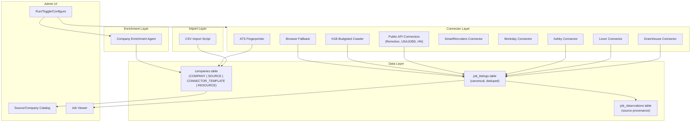

# API/ATS-First Job Scraping Pipeline — Full Implementation Plan

## Current state (for next session)

- **Done:** Phases 1–8; Phase 4/5 in practice. User reported they were at **Phase 11 or 12**. So assume Phases 9 (dedupe/repair) and 10 (Lever connector) are done or in progress. See `.cursor/CONTEXT-pipeline.md` for paths.
- **Next:** Continue from **Phase 11** (ATS connector scaffolds: Ashby, SmartRecruiters, Recruitee, Personio, Workday stubs) or **Phase 12** (H1B budgeted crawler), per user.

---

## Current State

The codebase has partially transitioned away from the old "blessed sources" scraping model:

- Migration `0008` already dropped `blessed_sources`, `job_listings_cache`, `scrape_visited_urls`, `scrape_state`, `admin_agent_logs`, `admin_brain_logs` tables
- But `schema.ts` still defines them, helpers still export them, and `scrape-loop.ts` / `brain-agent.ts` / `scrape-planner.ts` (1400+ lines) still exist unused
- Admin page is a bare placeholder; old admin UI is archived in `miscellaneous/old implementation/`
- Admin API routes for blessed-sources and scrape control still reference dropped tables

We are building a **new** scraping subsystem from scratch with these principles:

- Single `companies` table for companies + sources + connectors + resources
- API-first: prefer public ATS JSON APIs over browser scraping
- 100-company priority target list seeded from CSV
- Big boards kept in catalog but `enabled_for_scraping=false` by default
- Button-driven admin; scheduler disabled by default
- Canonical job cache with dedupe by `apply_url`
- Evidence stored as file paths only
- $0 budget, Ollama-only, local-only

---

## Architecture Overview



---

## Phase 1: Codebase Cleanup (Dead Code Removal)

**Goal:** Remove all dead code referencing dropped tables so the codebase compiles cleanly.

**Files to modify:**

- [packages/db/src/schema.ts](packages/db/src/schema.ts) — Remove definitions for `blessedSources`, `jobListingsCache`, `scrapeVisitedUrls`, `scrapeState`, `adminAgentLogs`, `adminBrainLogs`. Also remove the FK from `jobs.jobListingCacheId` that references `jobListingsCache`.
- [packages/db/src/index.ts](packages/db/src/index.ts) — Remove exports for `blessed-sources`, `job-listings-cache`, `scrape-visited-urls`, `admin-scrape-logs`
- Delete or archive helper files: `packages/db/src/blessed-sources.ts`, `packages/db/src/job-listings-cache.ts`, `packages/db/src/scrape-visited-urls.ts`, `packages/db/src/admin-scrape-logs.ts`
- Archive to `miscellaneous/old implementation/`: `apps/web/lib/scrape-loop.ts`, `apps/web/lib/scrape-planner.ts`, `apps/web/lib/brain-agent.ts`, `apps/web/lib/scraper-state.ts`, `apps/web/lib/brain-logs.ts`, `apps/web/lib/agent-logs.ts`, `apps/web/lib/captcha-state.ts`, `apps/web/lib/login-wall-state.ts`
- Remove/archive dead admin API routes: `apps/web/app/api/admin/blessed-sources/`, `apps/web/app/api/admin/scrape/`
- Update `packages/db/src/seed.ts` — remove `BLESSED_SOURCES` and `seedBlessedSourcesTable`; keep `ensureDefaultUser`
- Remove `scripts/scrape-blessed-sources.mjs`

**Acceptance criteria:**

- `npm run build` succeeds with zero reference errors to dropped tables
- No imports reference blessed_sources, jobListingsCache, scrapeState, adminAgentLogs, or adminBrainLogs
- Existing features (profile, preferences, application assistant) still work

---

## Phase 2: New Database Schema

**Goal:** Define the three new core tables in Drizzle and apply the migration.

**File:** [packages/db/src/schema.ts](packages/db/src/schema.ts) — Add new enums + tables at the bottom (after existing tables)

**New enums:**

- `entity_type`: COMPANY | SOURCE | CONNECTOR_TEMPLATE | RESOURCE
- `ats_type`: GREENHOUSE | LEVER | ASHBY | SMARTRECRUITERS | RECRUITEE | PERSONIO | WORKDAY | UNKNOWN
- `scrape_strategy`: AUTO | API_JSON | API_XML | BROWSER_FALLBACK
- `scrape_status`: OK | ERROR | BLOCKED | CAPTCHA | LOGIN_WALL | EMPTY | SKIPPED
- `enrichment_status`: PENDING | RUNNING | DONE | ERROR
- `remote_type` (for jobs): REMOTE | HYBRID | ONSITE | UNKNOWN
- `job_status`: OPEN | CLOSED | UNKNOWN

**New tables:**

1. `companies` — full schema as specified in the prompt (id, type, name, normalized_name, url, origin, kind, is_priority_target, enabled_for_scraping, parent_company_id, ats_type, scrape_strategy, connector_config, last_fingerprinted_at, last_scraped_at, last_status, last_error, scrape_interval_minutes, scheduler_enabled, test_budget, description_text, enrichment_sources, enrichment_status, last_enriched_at, industries, hq_location, size_range, founded_year, funding_stage, public_company, ticker, remote_policy, sponsorship_signals, hiring_locations, tech_stack_hints, website_domain, job_count_total, job_count_open, created_at, updated_at)
2. `job_listings` — canonical job cache (id, company_id FK, title, location, remote_type, employment_type, level, job_url, apply_url, external_id, description_text, description_html, posted_at, first_seen_at, last_seen_at, status, dedupe_key UNIQUE, raw_extract, evidence_paths, created_at, updated_at)
3. `job_observations` — multi-source provenance (job_id FK, source_id FK, observed_url, observed_at, content_hash, unique(job_id, source_id))

**Indexes:**

- `companies`: index on (type), index on (is_priority_target), index on (ats_type)
- `job_listings`: unique(dedupe_key), index(company_id, status), index(last_seen_at)
- `job_observations`: unique(job_id, source_id)

**New helpers:**

- `packages/db/src/companies.ts` — CRUD for companies table
- `packages/db/src/job-listings.ts` — CRUD + upsert-by-dedupe-key for job_listings
- `packages/db/src/job-observations.ts` — insert/query for job_observations

**Acceptance criteria:**

- `npm run db:migrate` succeeds; all three tables created in Postgres
- Can insert a COMPANY row and a SOURCE row (with parent_company_id) via helper
- Can insert a job_listing and a job_observation
- Existing tables (users, profiles, etc.) unaffected

---

## Phase 3: CSV Import Script

**Goal:** Seed the `companies` table from `CareerSignal_Master_Sources.csv`.

**File:** `scripts/import-sources-from-csv.ts` (new)

**Logic:**

- Parse CSV (130 rows): columns are `name,url,kind,origin`
- Classification rules:
  - `kind=company_careers` AND `origin` contains "Master_100" -> type=COMPANY, is_priority_target=true
  - `kind=h1b_job_board_or_resource` -> type=RESOURCE, is_priority_target=false
  - `kind=ats_connector_template` -> type=CONNECTOR_TEMPLATE
  - `kind=public_jobs_api` -> type=SOURCE
  - `kind=community` -> type=SOURCE
- Big boards detection (LinkedIn, Indeed, Glassdoor, ZipRecruiter, Handshake, CareerShift, Interstride, Zippia): set enabled_for_scraping=false
- H1B data sites (h1bdata.info, H1BGrader): type=RESOURCE, enabled_for_scraping=false (data/reference sites, not job boards)
- `normalized_name`: lowercase, trim, remove special chars
- `website_domain`: extract domain from URL where possible
- Upsert by normalized_name (idempotent)

**Root package.json:** Add script `"sources:import": "npx tsx scripts/import-sources-from-csv.ts"`

**Acceptance criteria:**

- `npm run sources:import` runs without errors
- 100 COMPANY rows with is_priority_target=true in DB
- ~18 RESOURCE/SOURCE rows for H1B boards/resources
- 7 CONNECTOR_TEMPLATE rows for ATS patterns
- ~3 SOURCE rows for public APIs/community
- Big boards have enabled_for_scraping=false
- Running twice produces no duplicates

---

## Phase 4: shadcn/ui Setup + Admin Layout

**Goal:** Install shadcn/ui in the Next.js app and create a proper admin layout with navigation.

**Changes:**

- Install shadcn/ui CLI and init in `apps/web/`
- Add core components: Button, Table, Badge, Dialog, Input, Select, Switch, Tabs, DropdownMenu, Card, Separator, Toast/Sonner
- Create `apps/web/app/admin/layout.tsx` with sidebar or tab navigation:
  - Catalog (companies/sources)
  - Jobs (cached jobs viewer — Phase 15)
- Style consistent with existing app (Tailwind)

**Acceptance criteria:**

- Admin page at `/admin` renders with shadcn components
- Navigation between admin sub-pages works
- No visual regressions on existing pages

---

## Phase 5: Admin — Source/Company Catalog (Read-Only)

**Goal:** Build the main admin catalog view showing all companies/sources in a filterable table.

**Files:**

- `apps/web/app/admin/page.tsx` — main catalog page (server component + client data table)
- `apps/web/app/api/admin/catalog/route.ts` — GET endpoint returning companies with filters
- `apps/web/app/admin/components/CatalogTable.tsx` — client component with shadcn DataTable

**Table columns:**

- Name, Type (badge), Enabled (switch), Priority Target (badge), ATS Type, Scrape Strategy, Last Status (color-coded badge), Last Scraped At, Jobs Open/Total

**Filters:**

- Type dropdown (ALL | COMPANY | SOURCE | RESOURCE | CONNECTOR_TEMPLATE)
- Priority only toggle
- Enabled only toggle
- ATS type dropdown
- Text search on name

**Acceptance criteria:**

- All imported companies/sources visible in the table
- Filters narrow results correctly
- Pagination works for 130+ rows
- Type badges use distinct colors

---

## Phase 6: Admin — Row Actions (Toggles + Config + Button Stubs)

**Goal:** Add interactive controls to each catalog row.

**API routes:**

- `apps/web/app/api/admin/catalog/[id]/route.ts` — PATCH (update enabled_for_scraping, test_budget, scrape_strategy, etc.)
- `apps/web/app/api/admin/catalog/[id]/fingerprint/route.ts` — POST (stub: returns 501)
- `apps/web/app/api/admin/catalog/[id]/scrape/route.ts` — POST (stub: returns 501)
- `apps/web/app/api/admin/catalog/[id]/enrich/route.ts` — POST (stub: returns 501)

**UI per row (dropdown menu or inline):**

- Enable/Disable scraping toggle (works immediately)
- "Configure Budget" dialog (max_pages, max_jobs, timeout_ms) -> saves to test_budget jsonb
- "Run Fingerprinting" button (calls stub, shows toast)
- "Run Scrape Now" button (calls stub, shows toast)
- "Run Enrichment" button (only for type=COMPANY, calls stub)

**Acceptance criteria:**

- Toggle enable/disable persists to DB and reflects in UI
- Budget configuration saves and loads correctly
- Stub buttons return 501 with "Not implemented yet" message
- Toast notifications on action

---

## Phase 7: ATS Fingerprinting Engine

**Goal:** Auto-detect which ATS a company uses from its careers URL.

**File:** `packages/core/src/fingerprint.ts` (new) or `agents/src/browser/ats-fingerprinter.ts`

**Detection strategies (ordered by reliability):**

1. **URL pattern matching** (fastest, no HTTP needed):

- `boards.greenhouse.io/` or `*.greenhouse.io` -> GREENHOUSE
- `jobs.lever.co/` -> LEVER
- `jobs.ashbyhq.com/` or `*.ashbyhq.com` -> ASHBY
- `*.smartrecruiters.com` -> SMARTRECRUITERS
- `*.recruitee.com` -> RECRUITEE
- `*.jobs.personio.de` -> PERSONIO
- `*.myworkdayjobs.com` or `*.wd[1-5].myworkdayjobs.com` -> WORKDAY

1. **HTTP probe** (if URL pattern doesn't match):

- Try known API endpoints with extracted domain/path tokens
- Check response content-type and structure

1. **HTML meta tag inspection** (lightest browser-like check):

- Fetch careers page HTML, look for ATS-identifying meta tags, scripts, or link patterns

**Output:** Updates `companies.ats_type`, `companies.scrape_strategy` (AUTO -> resolved), `companies.connector_config` (extracted board token/account), `companies.last_fingerprinted_at`

**Wire to admin:** Replace the 501 stub for "Run Fingerprinting" with real logic.

**Acceptance criteria:**

- Companies with Greenhouse URLs (e.g., boards.greenhouse.io/...) correctly identified
- Companies with Workday URLs (e.g., .myworkdayjobs.com) correctly identified
- Lever, Ashby patterns detected
- `connector_config` populated with extracted board token
- Admin button triggers fingerprinting and updates the row in real-time
- Unit tests for URL pattern matching covering all 7 ATS types

---

## Phase 8: Greenhouse Connector (End-to-End)

**Goal:** Implement the first complete ATS connector — fetch jobs from Greenhouse's public API, normalize into canonical `job_listings`, handle dedupe, and store evidence.

**Files:**

- `packages/core/src/connectors/base-connector.ts` — abstract ConnectorInterface
- `packages/core/src/connectors/greenhouse.ts` — Greenhouse implementation
- `packages/core/src/connectors/registry.ts` — connector lookup by ats_type
- `packages/core/src/dedupe.ts` — dedupe_key computation (normalize apply_url; fallback chain)
- `tests/connectors/greenhouse.test.ts` — unit tests with fixtures

**ConnectorInterface:**

```typescript
interface ConnectorResult {
  jobs: CanonicalJob[];
  evidencePath: string;
  errors: string[];
}

interface Connector {
  readonly atsType: AtsType;
  fetch(config: ConnectorConfig, budget: TestBudget): Promise<ConnectorResult>;
}
```

**Greenhouse connector logic:**

1. GET `https://boards-api.greenhouse.io/v1/boards/{boardToken}/jobs?content=true`
2. Parse JSON response
3. For each job: normalize to canonical `job_listings` schema

- `dedupe_key` = normalized `absolute_url` (the apply URL from Greenhouse)
- `external_id` = Greenhouse job `id`
- Map `location.name` -> `location`
- Map `departments[0].name` -> level/department

1. Save raw JSON response to `data/evidence/greenhouse/{boardToken}/{timestamp}.json`
2. Upsert into `job_listings` (by dedupe_key)
3. Insert `job_observations` (source_id = the COMPANY row's id)
4. Create company on-the-fly if needed
5. Update `companies.job_count_open`, `companies.job_count_total`
6. Update `companies.last_scraped_at`, `companies.last_status`

**Fixtures:** Save a real Greenhouse API response (e.g., from a known public board) as `tests/fixtures/greenhouse-response.json` for deterministic tests.

**Test cases:**

- Normalization produces correct canonical fields
- dedupe_key is stable across re-fetches
- Re-fetch doesn't create duplicate job_listings rows
- Evidence file is written to disk
- job_observations created with correct source_id
- Job counts updated on company row

**Wire to admin:** Replace the 501 stub for "Run Scrape Now" — when ats_type=GREENHOUSE, call Greenhouse connector.

**Acceptance criteria:**

- Can scrape a real Greenhouse board (e.g., a known public one) and see jobs in DB
- Admin "Run Scrape Now" button works for Greenhouse companies
- Evidence JSON saved to disk at correct path
- Tests pass with fixtures

---

## Phase 9: Canonical Caching + Dedupe Logic

**Goal:** Harden the caching layer with proper dedupe, no-refetch behavior, and count maintenance.

**Dedupe key computation** (`packages/core/src/dedupe.ts`):

- Primary: normalized `apply_url` (lowercase, strip tracking params like utm, strip trailing slash, sort query params)
- Fallback 1: `external_id` prefixed with source identifier (e.g., `gh:{id}`)
- Fallback 2: `job_url` normalized
- Fallback 3: hash of `title + company_name + location` (last resort)

**No-refetch rule:**

- If `job_listings` row exists with matching `dedupe_key` and `status != CLOSED`:
  - Update `last_seen_at` only
  - Do NOT re-fetch the detail page
  - Unless admin passes `force=true`

**Count maintenance:**

- After any job insert/update batch, run:

```sql
  UPDATE companies SET
    job_count_total = (SELECT count(*) FROM job_listings WHERE company_id = companies.id),
    job_count_open = (SELECT count(*) FROM job_listings WHERE company_id = companies.id AND status = 'OPEN')
  WHERE id = $company_id


```

- Admin repair utility: `scripts/repair-job-counts.ts` — recomputes ALL company counts

**Create company on-the-fly:**

- When a connector returns a job with a company name not in `companies`:
  - `normalized_name` = lowercase+trim
  - Check if normalized_name already exists
  - If not, create COMPANY row with is_priority_target=false
  - Extract `website_domain` from URLs if available

**Acceptance criteria:**

- Same job scraped twice -> one row, updated `last_seen_at`
- Job from two different sources -> one `job_listings` row, two `job_observations` rows
- Count repair script produces correct counts
- Unknown company auto-created in DB
- Force-refetch flag works

---

## Phase 10: Lever Connector

**Goal:** Second ATS connector, proving the ConnectorInterface pattern works for multiple ATS types.

**File:** `packages/core/src/connectors/lever.ts`

**Lever API:**

- GET `https://api.lever.co/v0/postings/{account}?mode=json`
- Response is an array of postings with fields: `id`, `text` (title), `categories.location`, `categories.team`, `categories.commitment`, `hostedUrl`, `applyUrl`, `descriptionPlain`, `lists[]` (requirements, responsibilities)

**Normalization mapping:**

- `dedupe_key` from normalized `applyUrl`
- `external_id` = Lever posting `id`
- `categories.commitment` -> employment_type
- `categories.location` -> location
- `hostedUrl` -> job_url
- `applyUrl` -> apply_url

**Fixtures + tests:** Same pattern as Greenhouse.

**Wire to admin:** "Run Scrape Now" for ats_type=LEVER calls Lever connector.

**Acceptance criteria:**

- Can scrape a real Lever board and see normalized jobs in DB
- Tests pass with fixtures
- Dedupe works across Lever + Greenhouse if same job appears on both

---

## Phase 11: ATS Connector Scaffolds (Remaining 5)

**Goal:** Create stub connectors for Ashby, SmartRecruiters, Recruitee, Personio, Workday so the registry is complete and future implementation is straightforward.

**Files:**

- `packages/core/src/connectors/ashby.ts`
- `packages/core/src/connectors/smartrecruiters.ts`
- `packages/core/src/connectors/recruitee.ts`
- `packages/core/src/connectors/personio.ts`
- `packages/core/src/connectors/workday.ts`

Each scaffold:

- Implements ConnectorInterface
- Has the correct API endpoint URL pattern documented
- `fetch()` throws "Not implemented yet" with a clear TODO
- Includes a comment block with the expected API response shape

**Registry update:** All 7 ATS types resolve to their connector.

**Acceptance criteria:**

- `registry.getConnector('ASHBY')` returns the Ashby stub (and so on for all 5)
- Calling `fetch()` on a stub throws a descriptive error
- TypeScript compiles cleanly

---

## Phase 12: H1B Resources — Budgeted Crawler

**Goal:** Implement a budgeted browser-based crawler for H1B job boards/resources that are not ATS-backed.

**Files:**

- `packages/core/src/connectors/budgeted-crawler.ts` — generic budgeted HTML crawler
- Uses Playwright (already a dependency) for pages that need JS rendering
- Falls back to plain `fetch` for static HTML

**Budget enforcement:**

- `test_budget` from company row: `{ max_pages: N, max_jobs: N, timeout_ms: N }`
- Visited URL set (in-memory per run) prevents infinite loops
- Strict timeout via `AbortController` or Playwright timeout

**Per-source flow:**

1. Fetch the source URL
2. Save raw HTML to `data/evidence/crawl/{source_slug}/{timestamp}.html`
3. Attempt job extraction (CSS selectors, heuristics, or LLM fallback)
4. For each extracted job: normalize -> upsert into `job_listings` + `job_observations`
5. Follow pagination links up to `max_pages`
6. Record `last_status` and `last_error` on the company row

**Key sources targeted:** H1BVisaJobs, MyVisaJobs, TechFetch H1B, USponsorMe, UnitedOPT, OPTNation, DesiOPT, RemoteRocketship

**Admin wiring:** "Test Scrape" button for RESOURCE/SOURCE rows calls budgeted crawler. Still writes to DB (no dry-run mode).

**Acceptance criteria:**

- Can crawl one H1B source (e.g., H1BVisaJobs) with budget max_pages=2, max_jobs=10
- Raw HTML saved to disk
- Whatever jobs could be extracted appear in `job_listings`
- Budget is enforced: crawl stops at limit
- `last_status` updated on company row
- Errors recorded in `last_error`

---

## Phase 13: Public API Connectors (Remotive, USAJOBS, HN)

**Goal:** Implement connectors for the three public non-ATS APIs in the CSV.

**Files:**

- `packages/core/src/connectors/remotive.ts` — `GET https://remotive.com/api/remote-jobs`
- `packages/core/src/connectors/usajobs.ts` — `GET https://data.usajobs.gov/api/search` (requires free API key via email registration)
- `packages/core/src/connectors/hn-whos-hiring.ts` — Parse latest "Who is Hiring?" thread from HN Algolia API

**Each connector:**

- Pure HTTP JSON (no browser needed)
- Normalize into `job_listings`
- Save evidence JSON to disk
- Budget-aware (respect max_jobs)

**Acceptance criteria:**

- Remotive returns real remote jobs, normalized and cached
- HN parser extracts jobs from monthly thread
- USAJOBS noted as requiring free key (documented, not auto-provisioned)
- Tests with fixtures for each

---

## Phase 14: Company Enrichment Agent

**Goal:** Implement the enrichment runner that crawls and aggregates company information.

**Files:**

- `agents/src/enrichment/company-enrichment-agent.ts` — main runner
- `agents/src/enrichment/search-provider.ts` — pluggable search (DuckDuckGo HTML scrape, Wikipedia API, direct domain crawl)
- `packages/db/src/companies.ts` — update enrichment fields

**Runner flow (given company_id):**

1. Load company row, get domain
2. Crawl company URL (careers page, /about page) — bounded: max 5 pages
3. Query search provider for `"{company name}" company overview`

- Primary: DuckDuckGo HTML (parse result snippets, no API key needed)
- Fallback: Wikipedia API (free, no key)
- Fallback: Direct domain crawl of known paths (/about, /company, /team)

1. Fetch top 3-5 links from search results (budgeted)
2. Extract text content, use Ollama FAST model to produce:

- One clean `description_text` (2-3 paragraphs)
- Optional structured fields: industries, hq_location, size_range, etc.

1. Save `enrichment_sources` (URLs + evidence file paths)
2. Update `enrichment_status` = DONE, `last_enriched_at` = now

**Admin wiring:** Replace "Run Enrichment" 501 stub with real call.

**Acceptance criteria:**

- Can enrich one company (e.g., "Stripe") and get a clean description
- `enrichment_sources` contains URLs and file paths
- Enrichment status transitions: PENDING -> RUNNING -> DONE (or ERROR)
- Admin button triggers enrichment and status updates in UI
- Budget is enforced (no infinite crawling)
- Works even if Google blocks (falls back to DuckDuckGo/Wikipedia)

---

## Phase 15: Admin — Job Viewer

**Goal:** Add an admin page to browse all cached jobs.

**Files:**

- `apps/web/app/admin/jobs/page.tsx` — job listing viewer
- `apps/web/app/api/admin/jobs/route.ts` — GET with filters + pagination

**Features:**

- Table: title, company, location, remote_type, status, posted_at, first_seen_at, last_seen_at, source count
- Filters: company dropdown, status (OPEN/CLOSED/UNKNOWN), text search on title
- Click row to see full detail (description, apply_url, evidence_paths, observations)
- Show "Observed from N sources" with list of source names

**Acceptance criteria:**

- All cached jobs visible and filterable
- Job detail modal/page shows full info including observations
- Pagination works for large result sets

---

## Phase 16: Browser Fallback Strategy

**Goal:** For companies whose ATS can't be fingerprinted, provide a Playwright-based browser scrape as fallback.

**File:** `packages/core/src/connectors/browser-fallback.ts`

**Uses existing agents (kept from codebase, not archived):**

- `agents/src/browser/navigator-agent.ts` — Playwright navigation
- `agents/src/browser/dom-extractor-agent.ts` — job card extraction
- `agents/src/browser/pagination-agent.ts` — pagination handling
- `agents/src/browser/html-cleanup-agent.ts` — HTML cleanup
- `agents/src/normalize/job-normalizer-agent.ts` — normalization

**Flow:**

1. Navigate to company careers URL via Playwright
2. Extract job cards from DOM
3. Follow pagination (budgeted)
4. Normalize extracted jobs -> `job_listings`
5. Save HTML snapshots as evidence

**Budget enforced** via `test_budget` on company row.

**Admin wiring:** "Run Scrape Now" for ats_type=UNKNOWN or scrape_strategy=BROWSER_FALLBACK.

**Acceptance criteria:**

- Can scrape a non-ATS company careers page (e.g., a simple HTML job board)
- Jobs appear in `job_listings`
- Budget limits respected
- Falls back gracefully on errors (records last_status=ERROR)

---

## Phase 17: Scope Doc Updates + Integration Tests

**Goal:** Update project documentation to reflect the new architecture, and add integration tests for the full pipeline.

**Doc updates:**

- [miscellaneous/plan.md](miscellaneous/plan.md) — Update to reflect API-first pivot, new phase structure
- [miscellaneous/project_scope.md](miscellaneous/project_scope.md) — Update Sources Registry section, remove blessed sources references, add companies table design, update Admin section

**Integration tests:**

- `tests/pipeline/import-to-scrape.test.ts` — CSV import -> fingerprint -> Greenhouse scrape -> verify jobs in DB
- `tests/pipeline/cross-source-dedupe.test.ts` — Same job from two sources -> one job_listings row, two observations
- `tests/pipeline/count-repair.test.ts` — Insert jobs, verify counts, run repair, verify still correct

**Acceptance criteria:**

- Scope docs accurately describe the current system
- Integration tests pass
- No references to old blessed sources architecture in docs

---

## Key Files Summary

| File                                  | Phase    | Purpose                          |
| ------------------------------------- | -------- | -------------------------------- |
| `packages/db/src/schema.ts`           | 1, 2     | Clean old tables, add new ones   |
| `packages/db/src/companies.ts`        | 2        | CRUD for unified companies table |
| `packages/db/src/job-listings.ts`     | 2        | Canonical job cache operations   |
| `packages/db/src/job-observations.ts` | 2        | Source provenance tracking       |
| `scripts/import-sources-from-csv.ts`  | 3        | CSV import pipeline              |
| `apps/web/app/admin/layout.tsx`       | 4        | Admin layout with shadcn         |
| `apps/web/app/admin/page.tsx`         | 5        | Source/Company catalog           |
| `apps/web/app/api/admin/catalog/`     | 5, 6     | Catalog API endpoints            |
| `packages/core/src/fingerprint.ts`    | 7        | ATS detection engine             |
| `packages/core/src/connectors/`       | 8-13, 16 | All connectors                   |
| `packages/core/src/dedupe.ts`         | 9        | Dedupe key logic                 |
| `agents/src/enrichment/`              | 14       | Company enrichment agent         |
| `apps/web/app/admin/jobs/page.tsx`    | 15       | Job viewer UI                    |
